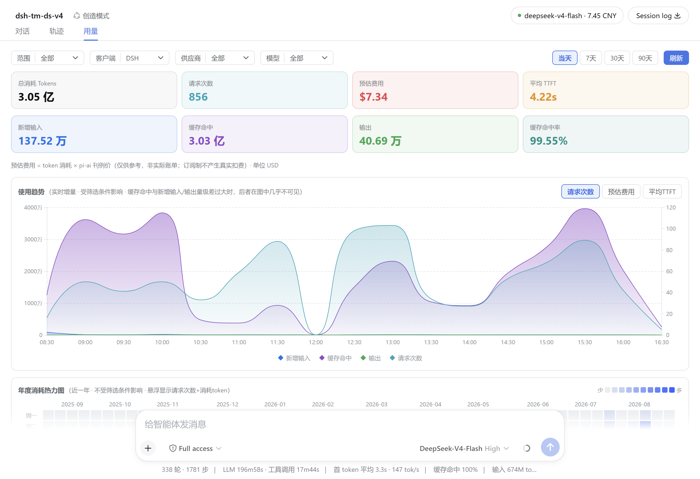
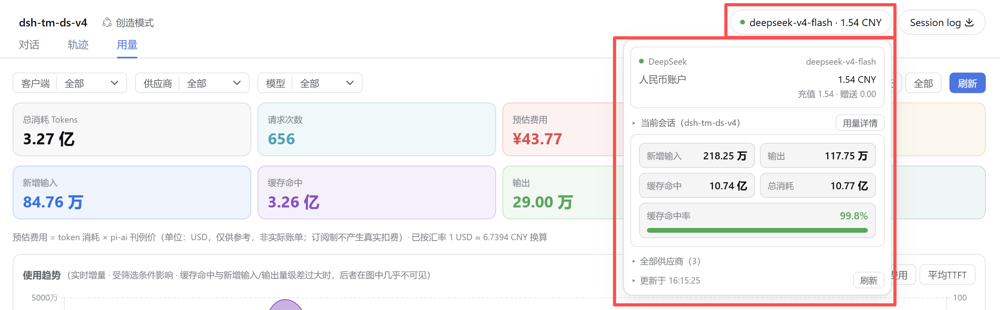
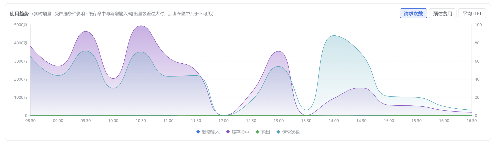
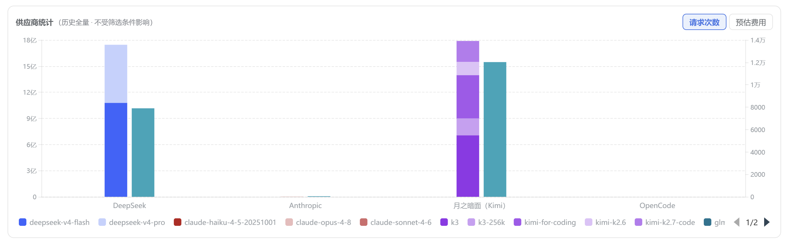
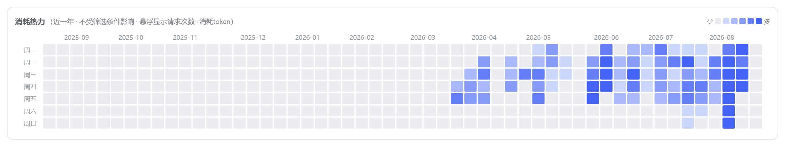
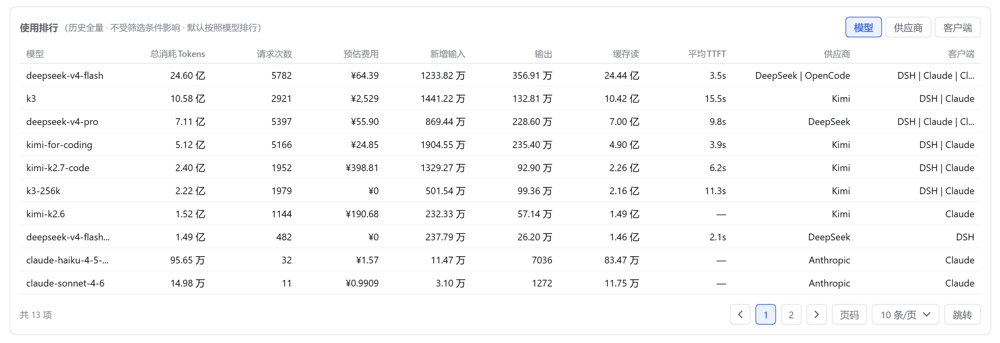
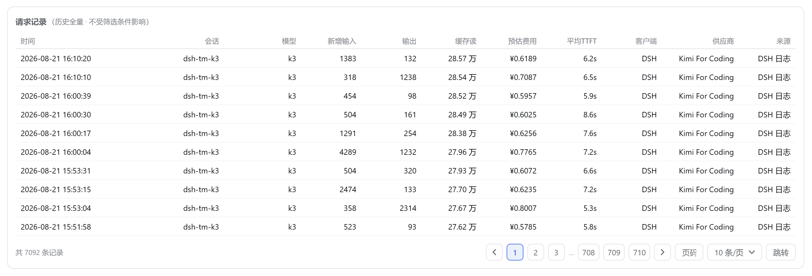

<div align="center">

# dsh-token-monitor

DeepSeek Harness（DSH）Web 界面的大模型**余量与用量监控**插件：会话头部实时余量徽标 + 主区"用量"页签，本地 SQLite 记录每次调用的 token 与费用。

[](https://github.com/licyer/dsh-token-monitor/releases)
[](https://www.npmjs.com/package/dsh-token-monitor)
[](LICENSE)
[](https://nodejs.org)

[功能](#功能) · [安装](#安装) · [供应商适配](#供应商适配) · [常见问题](#常见问题) · [架构](#架构) · [开发](#开发)

</div>

> [!NOTE]
> 需要 **Node.js ≥ 22**（依赖内置 `node:sqlite`）。仅支持 DSH Web 端（`platform: web`）。

<p align="center">
  <!-- TODO: hero 总览截图（用量页签整页） -->
  
</p>

## 功能

| 能力 | 说明 |
| --- | --- |
| 余量徽标 | 会话头部显示当前模型供应商余量（`k3 · 5h 剩 82%`），点击弹详情层 |
| 用量页签 | 与"对话 / 轨迹"并列：token 用量、估算费用、趋势、排行、请求明细 |
| 自动采集 | 字节级增量采集 DSH 会话日志（zstd 分帧），后台定时 + 手动触发 |
| 历史导入 | 可导入 cc-switch 历史记录，重复导入不产生重复数据 |
| 语言跟随 | 界面文案跟随 DSH 中文 / 英文切换 |

## 安装

### 从 npm（推荐）

```sh
dsh plugin --profile web add dsh-token-monitor
```

### 从 GitHub

```sh
dsh plugin --profile web add github:licyer/dsh-token-monitor
```

然后在 `~/.dsh/profiles/web/cordis.patch.yml` 顶层数组追加：

```yaml
- insert:
    - id: token-monitor
      name: dsh-token-monitor
```

重启 `dsh web` 生效。

## 余量监控

徽标显示当前模型供应商的余量：**订阅制**供应商（如 Kimi For Coding）显示滚动窗口与周额度百分比；**按量付费**供应商（如 DeepSeek 官方）显示账户余额。

点击徽标弹出详情层：当前提供方指标、本会话 token 用量（可切换会话）、全部提供方折叠区、cc-switch 数据同步提示条、更新时间与刷新。

<!-- TODO: 会话头部余量徽标（红框标注所在位置） -->

<!-- TODO: 徽标点击后的详情弹层（供应商指标 + 会话用量） -->


## 用量页签

顶部筛选（客户端 / 供应商 / 模型级联，供应商按厂商归并）+ 时间窗（当天 / 7 / 30 / 90 天 / 全部），统计卡显示总消耗、请求次数、预估费用、平均 TTFT、新增输入、缓存命中、输出、缓存命中率。

- **使用趋势**：渐变面积图，左轴 token 构成，右轴切换预估费用 / 请求次数；当天为分钟级刻度（2~60 分钟自适应 ≥12 桶，补桶不跨天）

<!-- TODO: 使用趋势图（含顶部统计卡与筛选行） -->


- **供应商消耗统计**：X 轴供应商、柱内按模型堆叠，右柱费用 / 次数可切换

<!-- TODO: 供应商消耗统计柱状图（堆叠双柱 + 右轴切换按钮） -->


- **年度消耗热力图**：GitHub 日历风，近 12 个整月，色深 = 当日 token，首尾按周补齐

<!-- TODO: 年度消耗热力图（日历格 + 图例） -->


- **使用排行**：模型 / 供应商 / 客户端三维度聚合，默认按总消耗降序

<!-- TODO: 使用排行表格（维度切换页签可见） -->


- **请求记录**：分页明细表（时间倒序），页码跳转、每页条数可调（10/20/50/100）

<!-- TODO: 请求记录表格（含底部分页器） -->


- **会话聚焦**：弹层"用量详情"→ 聚焦该会话，横幅可取消

## 插件配置

配置文件：`$DSH_HOME/storages/token-monitor/config.json`（Windows 默认 `C:\Users\<你>\.dsh\storages\token-monitor\config.json`）。

设置入口：DSH 设置面板（左下角齿轮）→ **Token Monitor** 页，表单保存后即时写回该文件。三个设置项：默认时间窗 / 余量轮询间隔（秒）/ 请求记录保留时间（天）。

| 字段 | 默认值 | 含义 |
| --- | --- | --- |
| `defaultDays` | `1` | 用量页签默认时间窗天数；`0` = 全部 |
| `pollMs` | `60` | 头部余量轮询间隔（单位秒，`5`–`86400`）。设置页与 `config.json` 均存秒，需要毫秒时由前端单独 ×1000 |
| `retentionDays` | `60` | 请求记录保留天数（超过此时长的记录会被定期清理，不影响聚合统计；设置页提供 30/60/90） |

行为约定：

- 文件**不存在**时插件自动创建一份默认值文件（纯 JSON），无需手动建；
- 已有文件**绝不覆盖**（含格式调整后缺新字段时，缺的字段回落默认值）；
- 文件**损坏**（非法 JSON）时用默认值运行，且**不覆盖**坏文件，仅记录警告；
- 设置页保存（`POST /token-monitor/config`）是唯一写入路径：合并更新已知字段，用户手加的未知键原样保留；非法值回落默认；保存前校验，空对象/非法 JSON 返回 400。

## 供应商适配

| 供应商 | 提供方 | 适配说明 |
| --- | --- | --- |
| Kimi（Moonshot AI） | Kimi For Coding | 订阅制额度：5h / 7d / 权益等级（百分比与重置倒计时） |
| DeepSeek | DeepSeek 官方 | 按量付费：账户余额 |
| OpenCode | OpenCode Go | 订阅制额度：5h / 7d / 30d （百分比与重置倒计时） |
| — | 其他提供方 | 未适配 |

## 常见问题

<details>
<summary><strong>徽标没显示或"查询失败"？</strong></summary>

A: 确认供应商凭证已配置（credentials seam 或环境变量）且 `providers` 声明了 `apiKeyEnv`；端点漂移可手动钉死 `url`。

</details>

<details>
<summary><strong>用量页签没数据？</strong></summary>

A: 用量来自会话日志采集：确认 `$DSH_HOME/sessions` 下有会话日志，点顶部"刷新"（先采集再查询）；CC 数据需在"数据来源"手动导入。

</details>

<details>
<summary><strong>费用准不准？</strong></summary>

A: 按 pi-ai 本地刊例价估算，仅供参考、非实际账单；订阅制不产生真实扣费。未定价模型计入 token 不计入费用。

</details>

## 已知限制

- 费用为估算（pi-ai 刊例价 + 每日汇率），非实际账单。
- 明细保留 60 天；更早的历史只能看按天聚合。
- 服务端窗口倒计时文案（如 `5h 后重置`）暂未多语言化。

## 架构

```
用户操作          ┌─ 定时器(5min) ─┐
  │               │  手动刷新      │
  ▼               ▼                ▼
页面查询 ──纯读──▶ SQLite ◀──字节级增量折叠── 会话日志(zstd)
(秒开)           (token-monitor.db)            ($DSH_HOME/sessions)
```

- 页面打开：先从数据库渲染（秒开）→ 后台触发一轮折叠 → 静默重载
- 查询路由**不**触发日志读取；折叠只由 定时器 / 手动刷新 / 打开后后台触发 驱动
- 折叠水位记录字节偏移（`last_offset`），只续读追加的日志帧
- 存储与同步设计详见 [设计文档](docs/DESIGN.md)

## 开发

```sh
git clone https://github.com/licyer/dsh-token-monitor.git
dsh plugin --profile web add link:/path/to/dsh-token-monitor   # 本地路径挂载
```

- 改前端（`lib/client.js`）：HMR 热替换，刷新即生效
- 改服务端（`lib/index.js` / `lib/util/`）：需重启 `dsh web` 进程

## 许可证

[MIT](LICENSE) © 2026 licyer
